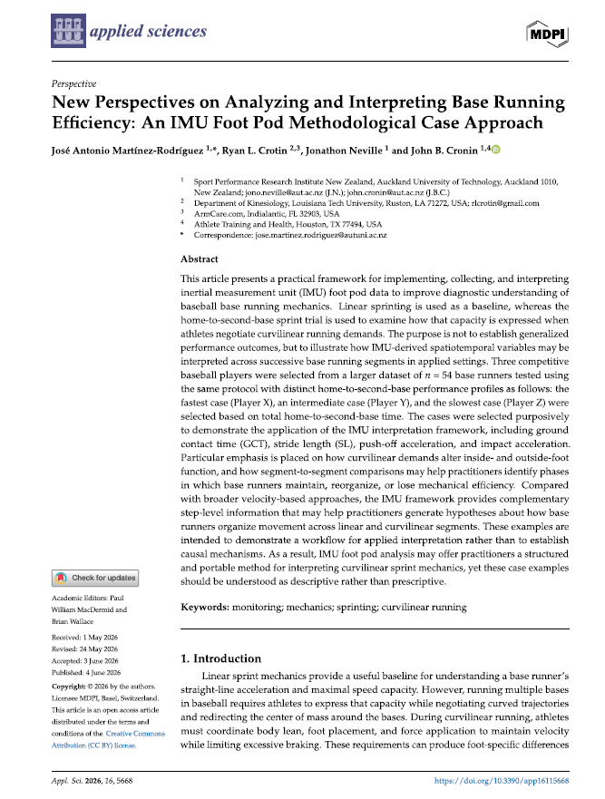

## Context

Base running science is not just a matter of raw sprint speed.

Our recent article in Applied Sciences, “New Perspectives on Analyzing and Interpreting Base Running Efficiency: An IMU Foot Pod Methodological Case Approach,” presents a practical framework for using IMU foot-pod data to evaluate how base runners organise their mechanics across linear and curvilinear sprinting demands.

The article uses linear sprinting as a baseline and the home-to-second-base sprint as a baseball-specific task to examine how base runners express speed while entering, negotiating, and exiting the curve around first base.

The framework focuses on step-level variables such as:

• Ground contact time
• Stride length
• Push-off acceleration
• Impact acceleration
• Inside- and outside-foot asymmetry
• Linear-to-curvilinear percent differences

A key message from the paper is that asymmetry should not automatically be interpreted as dysfunction. In curvilinear running, inside- and outside-foot roles may change by segment, task demand, and individual athlete strategy.

For practitioners, this approach offers a more detailed way to investigate why speed is gained, maintained, or lost during base running. Rather than relying only on timing splits or velocity outputs, IMU foot-pod analysis can help identify whether performance changes are associated with longer ground contact times, insufficient propulsion, excessive braking, or altered foot-specific mechanics.

The article is intended as a methodological and interpretive framework, not a set of universal performance norms. Its value lies in showing how wearable sensor data can support more individualized decision-making in baseball performance environments.
---

**Where it's published:**

[Read the full article](https://www.mdpi.com/1424-8220/26/8/2378){target="\_blank"}
