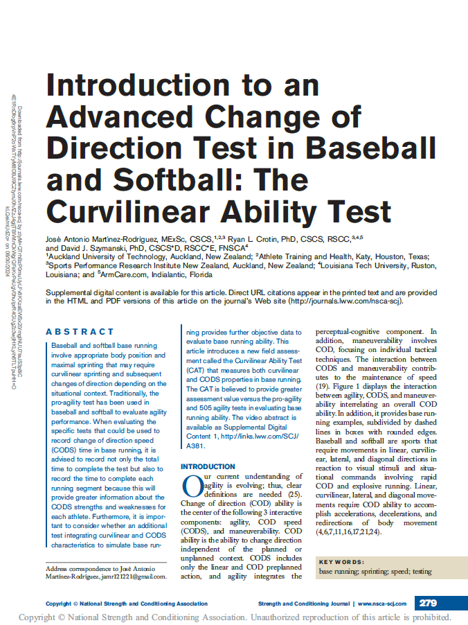

##Context

I’m excited to share our article introducing the Curvilinear Ability Test (CAT), a new field-based assessment designed to better capture the movement demands of baseball and softball base running. Unlike traditional change-of-direction tests, the CAT integrates curvilinear sprinting and change-of-direction speed to reflect the realities of how athletes actually move around the bases.

A key point from this work is that base running is not just about linear speed. The CAT was proposed to provide coaches and sport scientists with more specific information about curvilinear ability, COD performance, and segmental timing, helping identify movement strengths and weaknesses that may be missed by conventional tests.

This is an important step toward more sport-specific evaluation in baseball and softball, and I’m excited about its practical applications for talent identification, performance profiling, and training design.

#BaseRunning #Baseball #Softball #SportScience #StrengthAndConditioning #PerformanceTesting #ChangeOfDirection #CurvilinearSprinting #SportsPerformance

**Where it's published:**

[Read the full article](https://journals.lww.com/nsca-scj/abstract/2024/06000/introduction_to_an_advanced_change_of_direction.2.aspx){target="\_blank"}

---

