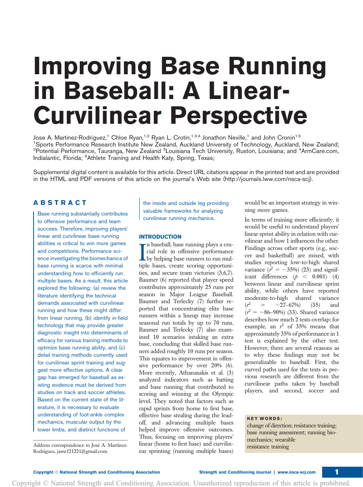

{fig-alt="First page of the paper, showing its title, authors, and abstract"}

Before we could ask how to improve base running, we first had to understand what makes running multiple bases different from sprinting in a straight line.

That is why I consider our new paper, *Improving Base Running in Baseball: A Linear–Curvilinear Perspective*, one of the foundational pieces of my PhD.

The challenge was that the baseball-specific evidence-based literature was extremely limited.

Much of what we currently know about curvilinear sprint mechanics comes from track and soccer. Those studies provide valuable biomechanical principles, but baseball presents different constraints: athletes select their own running paths, negotiate around the base, and continuously transition between acceleration, redirection, and reacceleration.

So this paper brought together the available literature to examine three broad areas:

- **Mechanics** — how curvilinear running differs from linear sprinting, including potential inside- and outside-limb roles.
- **Diagnostics** — how field-based technology could help us move beyond total sprint time.
- **Training** — how gym-based physical development and baseball-specific field training might be integrated to improve the ability to negotiate the curve.

One of the clearest findings from the review was not an answer — it was a research gap.

Existing studies were characterized by small samples, methodological differences, and curvilinear non-baseball-specific tasks. Most curvilinear training evidence came from young male soccer players rather than baseball players.

That matters because we should be careful not to confuse biomechanical plausibility with baseball-specific evidence.

The literature suggests that curved running introduces asymmetric demands between the inside and outside limbs and changes force application, foot position, and muscular requirements. But these ideas still require direct testing during actual baseball base running.

For me, this paper was the first floor of the building.

It helped establish:

- What we knew.
- What we were borrowing from other sports.
- What we still needed to measure.
- And what needed to be tested experimentally.

That framework helped shape much of the research that followed in the thesis.

**Understand the task → assess the task → train the task.**

**Train the base runner — not just the sprinter.**

**Where it's published:**

**Paper authors:** Jose A. Martinez-Rodriguez, Chloe Ryan, Ryan L. Crotin, Jonathon Neville, and John Cronin.

[Read the full article](https://doi.org/10.1519/SSC.0000000000000996){target="_blank"}

[Browse all research](../../articles.qmd) · [Explore the Base Running Science™ framework](../../framework.qmd)
