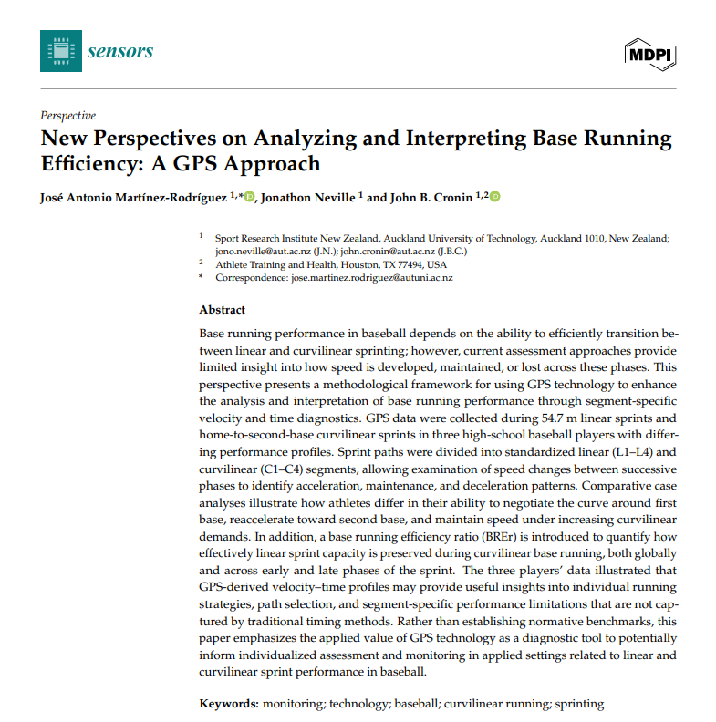

**Context**

Base running efficiency is already established in the literature, but there is still a need to better understand how that efficiency is expressed across the different phases of a sprint from home to second base.

In this paper, we build on existing base running efficiency concepts by improving how this metric is visualized and interpreted. Using GPS-derived segment-specific velocity and time data, we show how practitioners can identify where athletes accelerate, lose speed, reaccelerate, and manage the curve around first base.

Rather than focusing only on total time outcomes, this approach provides a more applied diagnostic framework for understanding individual base running strategies and performance limitations in both linear and curvilinear sprinting.

---

**Where it's published:**

[Read the full article](https://www.mdpi.com/1424-8220/26/8/2378){target="\_blank"}
---

