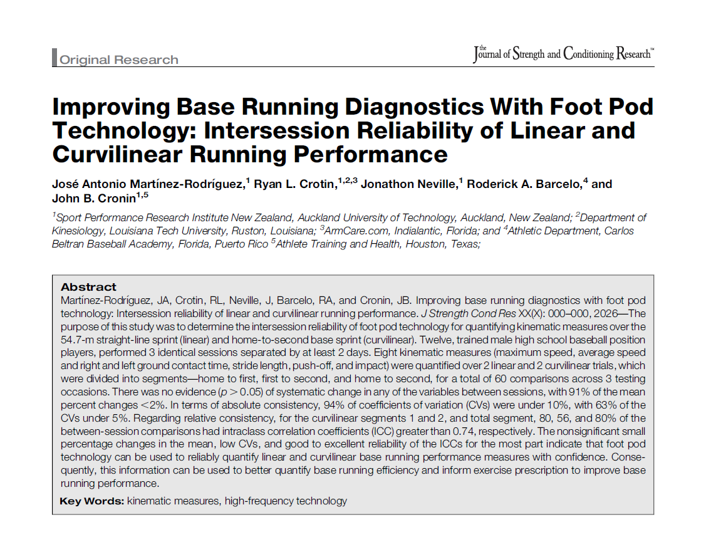

**Context**

This study examined the reliability of in-shoe inertial measurement unit (IMU) foot pod technology for quantifying kinematic variables during baseball base running.

The research evaluated whether foot pod sensors embedded in athletes’ shoes could reliably measure step-by-step mechanics during both linear sprinting (54.7 m) and curvilinear base running (home-to-second base). 

**Technology Used**

The study used Plantiga foot pod sensors, which contain:

1. 6-axis inertial measurement units
2. Triaxial accelerometers
3. Triaxial gyroscopes
4. Sampling frequency of 416 Hz

These sensors allow practitioners to measure detailed biomechanical variables at the step level, providing deeper insight into the mechanical demands of base running. 

**Variables Analyzed**

The study quantified several key kinematic metrics relevant to baseball base running:

1. Maximum speed
2. Average speed
3. Ground contact time (left and right foot)
4. Stride length (left and right foot)
5. Push-off acceleration (left and right foot)
6. Impact acceleration (left and right foot)

These metrics were analyzed across three baseball-specific sprinting segments and 
one linear sprinting segment:

1. Home to first base
2. First to second base
3. Home to second base
4. 54.7-m linear sprint

This segmental analysis provides a deeper understanding of the mechanical differences between linear and curvilinear sprinitng in baseball players.

**Key Findings**

The results demonstrated strong reliability across most kinematic variables, indicating that IMU foot pod technology can be used to confidently monitor base-running mechanics.

Major findings included:

1. **No statistically significant performance changes** between testing sessions
2. **94% of coefficient of variation values were below 10%**
3. Most reliability coefficients showed **good to excellent** intraclass correlation values
4. The majority of measurements demonstrated **high stability** across testing days. 

These results indicate that foot pod technology is a reliable tool for assessing baseball base running mechanics.

**Practical Applications**

Foot pod technology provides coaches and sport scientists with a deeper biomechanical understanding of base running, which can be used to improve athlete development.

Applications include:

1. **Base Running Diagnostics**
2. Identifying mechanical inefficiencies during curve running
3. **Performance Optimization**
4. Understanding stride mechanics and force application during base running
5. **Training Prescription**
6. Designing drills to improve stride efficiency and acceleration patterns
7. **Injury Risk Management**
8. Monitoring asymmetries between the inside and outside legs during curvilinear running

These insights allow practitioners to move beyond simple timing data and toward mechanically informed base-running coaching.

---

**Where it's published:**

[Read the full article](https://journals.lww.com/nsca-jscr/abstract/9900/improving_base_running_diagnostics_with_foot_pod.922.aspx){target="\_blank"}
---

