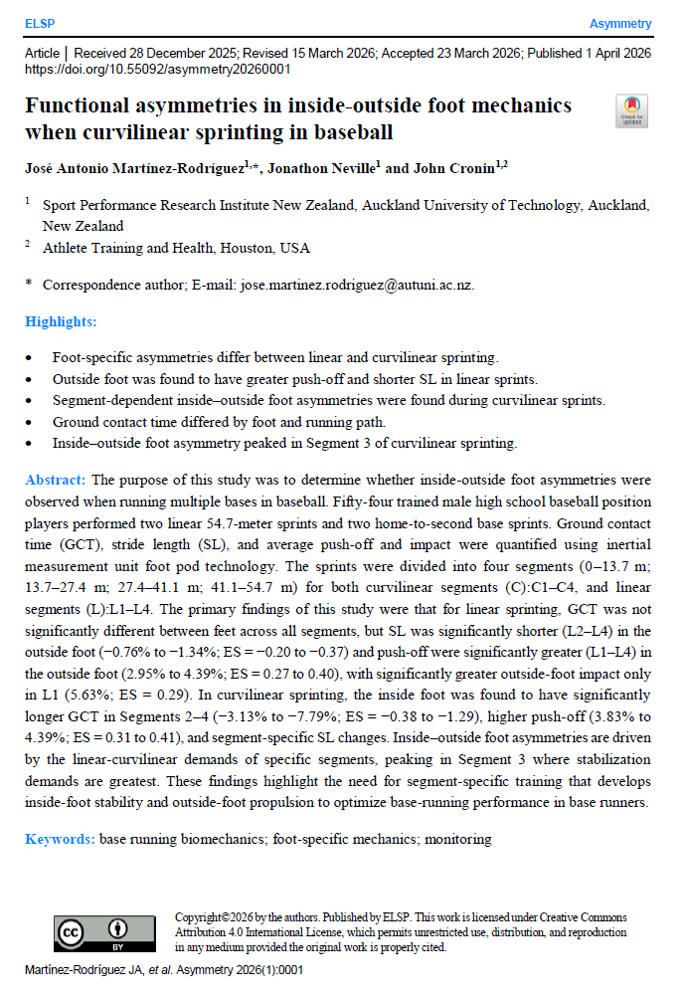

## Context

A new peer-reviewed publication further strengthens the scientific basis of Base Running Science by demonstrating that inside–outside foot mechanics differ meaningfully during curvilinear sprinting in baseball. A new peer-reviewed publication further strengthens the scientific basis of Base Running Science by demonstrating that inside–outside foot mechanics differ meaningfully during curvilinear sprinting in baseball.

Published in Asymmetry (2026), this study evaluated trained high school baseball players and quantified ground contact time (GCT), stride length (SL), push-off, and impact during both linear and curvilinear sprinting.

The findings were clear:

1. In linear sprinting, the outside foot demonstrated:

  a. shorter stride length from L2–L4 (−0.76% to −1.34%)
  b. greater push-off from L1–L4 (2.95% to 4.39%)
  c. greater impact in L1 (5.63%)

2. In curvilinear sprinting, the inside foot demonstrated:

  a. longer GCT in Segments 2–4 (−3.13% to −7.79%)
  b. higher push-off (3.83% to 4.39%)

Most notably, the greatest inside–outside asymmetry appeared in Segment 3, indicating that the middle phase of the curve imposes the highest stabilization demands.

These results reinforce an important point: 

curvilinear sprinting is not simply linear sprinting performed on a bend. It is a distinct locomotor task with foot-specific and segment-dependent demands.

That distinction matters for:

1. performance assessment
2. training design
3. return-to-play monitoring
4. long-term athlete development

Base running performance cannot be fully understood through straight-line metrics alone.

It must be evaluated in the context of the movement demands the game actually requires.

Base running is measurable.
Base running is monitorable.
Base running is scientific.

#BaseRunningScience #SportScience #BaseballPerformance #Biomechanics #CurvilinearSprinting

---

**Where it's published:**

[Read the full article](https://https://www.elspub.com/doi/10.55092/asymmetry20260001){target="\_blank"}

---

