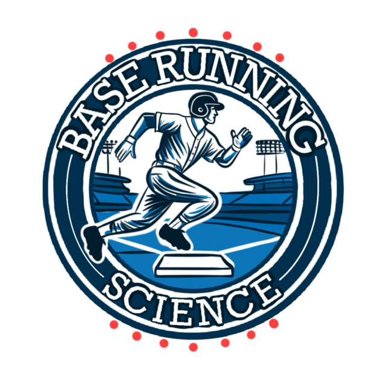
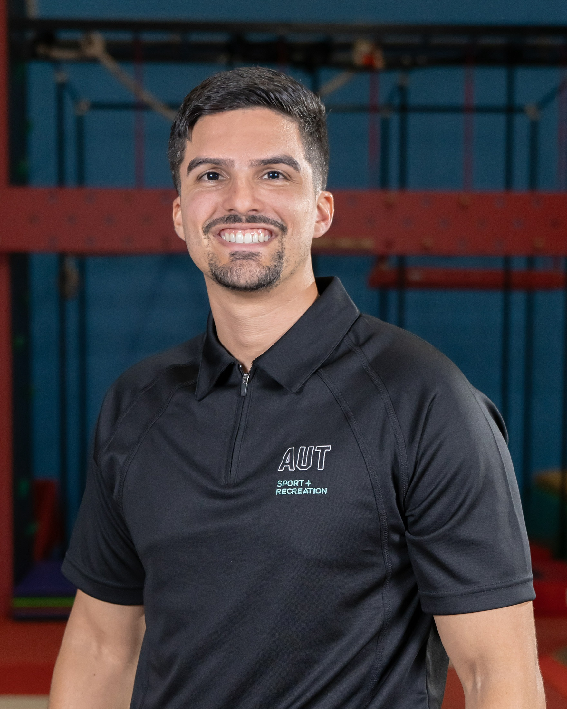

RESEARCH INFORMING BASEBALL DEVELOPMENT

# Base Running Science™

Scientific testing, base running training and individual player development for teams, academies and athletes.

Assess how a player accelerates, negotiates the curve and maintains speed between bases. Use those findings to guide individualized physical preparation and on-field base running training, then reassess to evaluate progress and adjust the programme.

<a class="btn-primary" href="services.html">Explore services</a><a class="brs-secondary" href="contact.html">Request a quote</a>

## Specialist support for your base running programme

Base Running Science™ is an independent business built around José Antonio Martínez-Rodríguez’s base running research. We work alongside base running directors, coaches, performance staff and analysts to connect measurement with practical player development.

Your staff retain responsibility for organizational strategy and day-to-day coaching. Base Running Science™ contributes specialist testing, interpretation, training, development support and evaluation. We serve multiple organizations and individual players; client data and confidential plans remain separate.

## Find the support you need

::: {.brs-service-grid}
::: {.brs-service-card}
### Teams and academies
Assessment pilots, diagnostic audits, validation projects and ongoing scientific support.

[Explore team services](teams.qmd)
:::
::: {.brs-service-card}
### Individual players
Local testing and coaching, retests and visiting or residential support.

[Explore player services](players.qmd)
:::
::: {.brs-service-card}
### Workshops
One-hour introductions and two-hour applied workshops for coaches and staff.

[Explore workshop packages](workshops.qmd)
:::
::: {.brs-service-card}
### Research and reporting
Research feasibility and custom spreadsheet reporting prototypes for a defined question or workflow.

[Explore research support](research-services.qmd)
:::
:::

## A framework that connects testing and development

**Assess → Build → Integrate → Overload → Reassess**

Identify a development priority, build the relevant qualities, integrate them into baseball-specific running, progress the task when appropriate, and reassess to evaluate change and guide the next stage.

[Understand the framework](framework.qmd)

## Founded on base running research

José Antonio Martínez-Rodríguez’s doctoral research at Auckland University of Technology examines linear and curvilinear running, segment-specific interpretation and the practical use of performance measurements. The research provides a foundation for the services; each application still requires attention to the player, protocol and measurement limitations.

[Meet the founder](about.qmd) · [Explore research and articles](articles.qmd)

<h3>Improving Base Running in Baseball: A Linear–Curvilinear Perspective</h3>

Why understanding the differences between straight-line sprinting and running multiple bases became a foundation of my PhD—and what still needs to be tested.

<a class="btn-primary" href="articles/article_4/Chapter4.html">Read the article</a>

## Start with your question

Tell us whether you represent a team or academy, are seeking individual player support, or want a workshop or research assistance. Include your location, preferred dates and the question you want to address.

[Request a tailored quote](contact.qmd)
