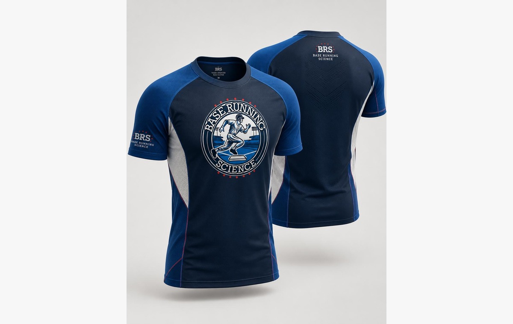
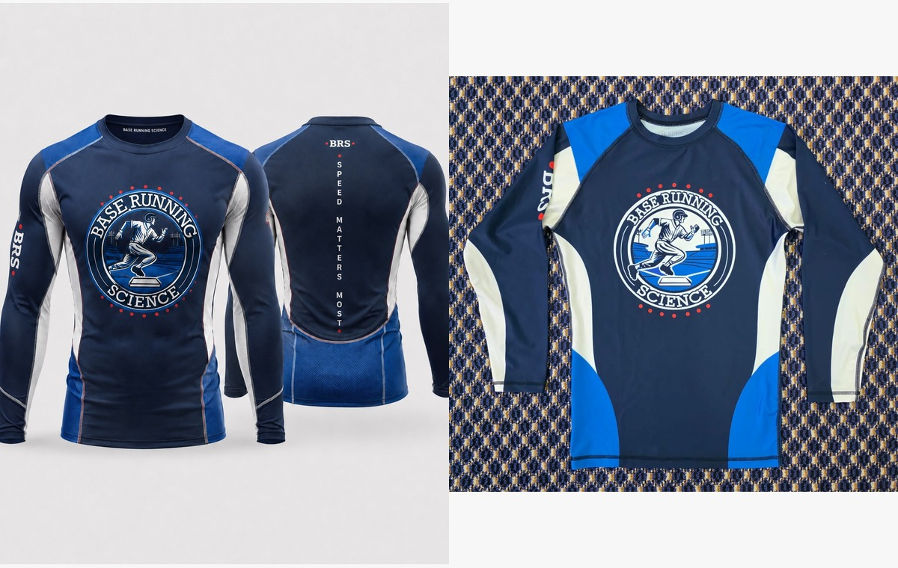
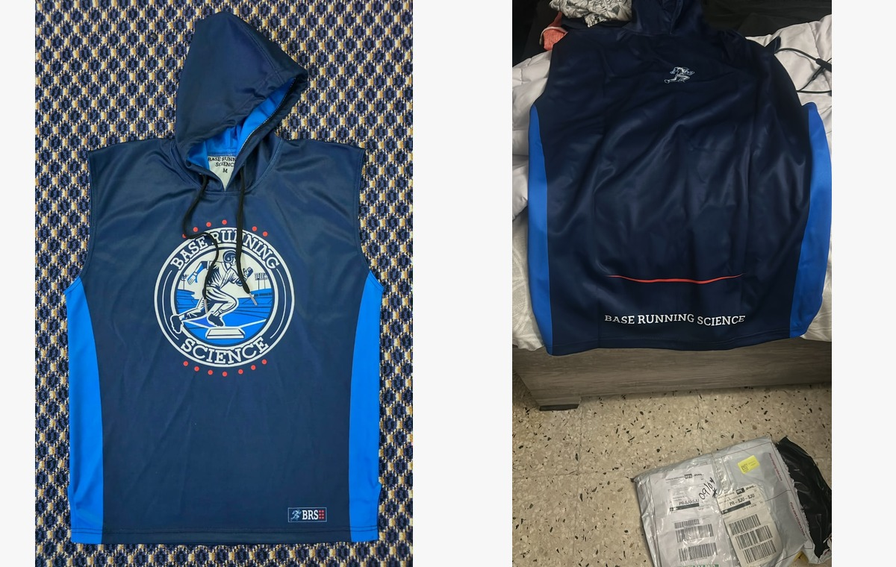
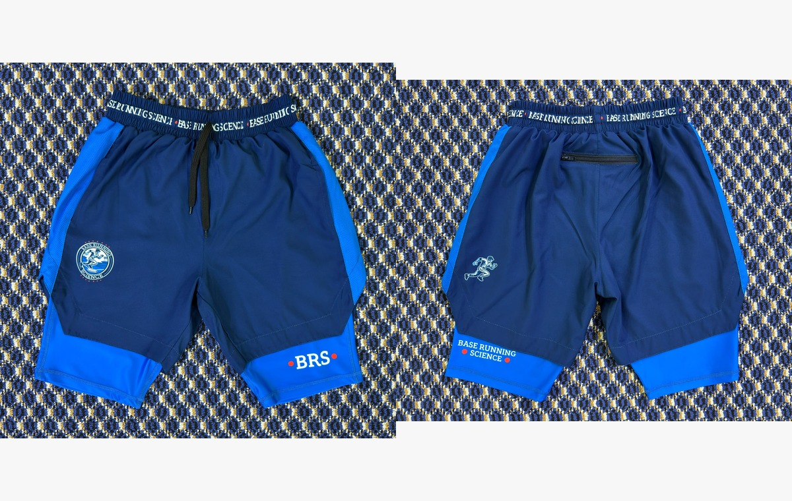

<section class="store-hero">

BASE RUNNING SCIENCE · SMALL-BATCH APPAREL

<h1>Base Running Science Store</h1>

Four research-inspired performance pieces, available individually or as thesis-topic sets. Select your size, build your cart, and submit your order directly from the Base Running Science website. Shipping is confirmed separately based on destination and final package weight.

</section>

<h2>Individual Pieces</h2>
Current launch pricing · shipping separate

<button class="store-cart-button" type="button" data-cart-toggle>Cart 0</button>

<h3>Short Sleeve</h3>
$35

Performance shirt for training and everyday baseball use.

<select data-size aria-label="Short sleeve size"><option>Medium</option><option>Large</option><option>XL</option></select><input data-qty type="number" min="1" max="10" value="1" aria-label="Quantity">
<button class="store-add" type="button" data-product="short-sleeve">Add to cart</button>

<h3>Long Sleeve</h3>
$45

Long-sleeve performance shirt designed around training mobility.

<select data-size aria-label="Long sleeve size"><option>Medium</option><option>Large</option><option>XL</option></select><input data-qty type="number" min="1" max="10" value="1" aria-label="Quantity">
<button class="store-add" type="button" data-product="long-sleeve">Add to cart</button>

<h3>Sleeveless Hoodie</h3>
$54

Sleeveless performance hoodie with Base Running Science branding.

<select data-size aria-label="Hoodie size"><option>Medium</option><option>Large</option><option>XL</option></select><input data-qty type="number" min="1" max="10" value="1" aria-label="Quantity">
<button class="store-add" type="button" data-product="hoodie">Add to cart</button>

<h3>Training Shorts</h3>
$34

Training shorts with integrated stretch compression liner.

<select data-size aria-label="Training shorts size"><option>Medium</option><option>Large</option><option>XL</option></select><input data-qty type="number" min="1" max="10" value="1" aria-label="Quantity">
<button class="store-add" type="button" data-product="training-shorts">Add to cart</button>

<section class="store-section">

<h2>Research-Inspired Sets</h2>
Bundle names are drawn from topics and methods developed through the Base Running Science thesis.

<small>CURVILINEAR ABILITY</small><h3>Curvilinear Ability Set</h3>
Short Sleeve + Training Shorts

<strong>$66</strong>Regular $69 · Save $3
<button class="bundle-add" data-bundle="curvilinear-ability">Add set</button>

<small>LINEAR–CURVILINEAR</small><h3>Linear–Curvilinear Set</h3>
Long Sleeve + Training Shorts

<strong>$75</strong>Regular $79 · Save $4
<button class="bundle-add" data-bundle="linear-curvilinear">Add set</button>

<small>INSIDE–OUTSIDE MECHANICS</small><h3>Inside–Outside Mechanics Set</h3>
Sleeveless Hoodie + Training Shorts

<strong>$84</strong>Regular $88 · Save $4
<button class="bundle-add" data-bundle="inside-outside">Add set</button>

<small>THE NEED FOR SPEED</small><h3>The Need for Speed Set</h3>
Short Sleeve + Long Sleeve

<strong>$76</strong>Regular $80 · Save $4
<button class="bundle-add" data-bundle="need-for-speed">Add set</button>

<small>GPS DIAGNOSTICS</small><h3>GPS Diagnostics Set</h3>
Short Sleeve + Sleeveless Hoodie

<strong>$85</strong>Regular $89 · Save $4
<button class="bundle-add" data-bundle="gps-diagnostics">Add set</button>

<small>IMU FOOT-POD</small><h3>IMU Foot-Pod Set</h3>
Long Sleeve + Sleeveless Hoodie

<strong>$94</strong>Regular $99 · Save $5
<button class="bundle-add" data-bundle="imu-foot-pod">Add set</button>

<small>SEGMENT-SPECIFIC ANALYSIS</small><h3>Segment-Specific Analysis Set</h3>
Short Sleeve + Long Sleeve + Training Shorts

<strong>$105</strong>Regular $114 · Save $9
<button class="bundle-add" data-bundle="segment-specific">Add set</button>

<small>FUNCTIONAL ASYMMETRY</small><h3>Functional Asymmetry Set</h3>
Short Sleeve + Hoodie + Training Shorts

<strong>$114</strong>Regular $123 · Save $9
<button class="bundle-add" data-bundle="functional-asymmetry">Add set</button>

<small>VELOCITY–TIME PROFILE</small><h3>Velocity–Time Profile Set</h3>
Long Sleeve + Hoodie + Training Shorts

<strong>$123</strong>Regular $133 · Save $10
<button class="bundle-add" data-bundle="velocity-time">Add set</button>

<small>NEW PERSPECTIVES</small><h3>New Perspectives Set</h3>
Short Sleeve + Long Sleeve + Hoodie

<strong>$124</strong>Regular $134 · Save $10
<button class="bundle-add" data-bundle="new-perspectives">Add set</button>

<small>TRAINING THE CURVE</small><h3>Training the Curve Complete Set</h3>
All four Base Running Science pieces

<strong>$152</strong>Regular $168 · Save $16
<button class="bundle-add" data-bundle="training-curve">Add set</button>

</section>

<aside id="store-cart" class="store-cart-panel" aria-label="Shopping cart">

<h2>Your Cart</h2><button id="cart-close" class="cart-close" type="button" aria-label="Close cart">×</button>

Merchandise subtotal<strong id="cart-subtotal">$0.00</strong>

ShippingConfirmed separately

Subtotal before shipping<strong id="cart-total">$0.00</strong>

<button id="checkout-open" class="checkout-open" type="button">Continue to checkout</button>
</aside>

<section id="checkout" class="checkout-shell">

<h2>Checkout</h2>

Submit your order details. No card or bank information is collected on this website.

<form id="brs-order-form" class="checkout-form" name="brs-order" method="POST" data-netlify="true" netlify-honeypot="bot-field" action="/order-received.html">
<input type="hidden" name="form-name" value="brs-order">
<input type="hidden" id="order-id" name="order_id">
<input type="hidden" id="order-total-field" name="merchandise_subtotal">
<input type="hidden" id="order-cart-json" name="cart_json">

<label>Do not fill this out: <input name="bot-field"></label>

<label>First name<input required name="first_name" autocomplete="given-name"></label>
<label>Last name<input required name="last_name" autocomplete="family-name"></label>
<label>Email<input required type="email" name="email" autocomplete="email"></label>
<label>Phone<input required name="phone" autocomplete="tel"></label>
<label class="full">Shipping address<input required name="address" autocomplete="street-address"></label>
<label>City<input required name="city" autocomplete="address-level2"></label>
<label>State / Territory<select required name="state"><option value="Puerto Rico">Puerto Rico</option><option value="US State">U.S. State</option></select></label>
<label>ZIP code<input required name="zip" inputmode="numeric" autocomplete="postal-code"></label>
<label>Delivery<select required name="delivery"><option>USPS shipping — quote after order</option><option>Local pickup — by arrangement</option></select></label>
<label class="full">Payment method<select id="payment-method" required name="payment_method"><option value="">Choose…</option><option>ATH Móvil</option><option>PayPal</option><option>Cash / Local Pickup</option></select></label>
<label class="full">Order summary<textarea id="order-summary-text" name="order_summary" rows="6" readonly></textarea></label>
<label class="full">Notes / sizes for bundle pieces<textarea name="customer_notes" rows="3" placeholder="For bundles, enter the size you want for each piece."></textarea></label>
<button class="order-submit" type="submit">Submit order</button>

Secure-payment design: this form collects order and contact information only. ATH Móvil/PayPal payment happens through the payment provider, not by entering sensitive payment credentials here.

</form>

<h3>Order Summary</h3>
Merchandise subtotal: <strong id="order-subtotal">$0.00</strong>

Shipping: <strong>confirmed after destination/weight review</strong>

<h3>Payment</h3>

<strong>Small-batch note:</strong> inventory is limited. An order submission is a reservation request until availability and payment are confirmed.

</section>

